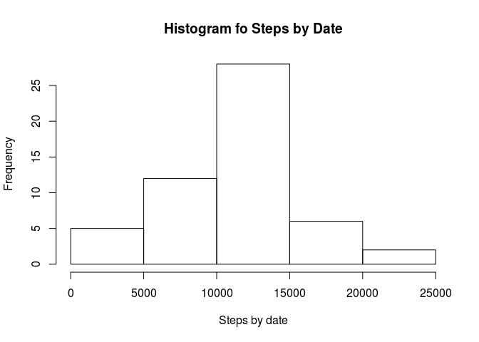

# Reproducible Research: Peer Assessment 1


## Loading and preprocessing the data


```r
library(data.table)
library(ggplot2)

df <- read.csv('./activity.csv')
DT <- data.table(df)
summary(DT)
```

```
##      steps                date          interval     
##  Min.   :  0.00   2012-10-01:  288   Min.   :   0.0  
##  1st Qu.:  0.00   2012-10-02:  288   1st Qu.: 588.8  
##  Median :  0.00   2012-10-03:  288   Median :1177.5  
##  Mean   : 37.38   2012-10-04:  288   Mean   :1177.5  
##  3rd Qu.: 12.00   2012-10-05:  288   3rd Qu.:1766.2  
##  Max.   :806.00   2012-10-06:  288   Max.   :2355.0  
##  NA's   :2304     (Other)   :15840
```

```r
str(DT)
```

```
## Classes 'data.table' and 'data.frame':	17568 obs. of  3 variables:
##  $ steps   : int  NA NA NA NA NA NA NA NA NA NA ...
##  $ date    : Factor w/ 61 levels "2012-10-01","2012-10-02",..: 1 1 1 1 1 1 1 1 1 1 ...
##  $ interval: int  0 5 10 15 20 25 30 35 40 45 ...
##  - attr(*, ".internal.selfref")=<externalptr>
```
## What is mean total number of steps taken per day?
Total steps by day

```r
DT[, sum(steps), by=date]$V1
```

```
##  [1]    NA   126 11352 12116 13294 15420 11015    NA 12811  9900 10304
## [12] 17382 12426 15098 10139 15084 13452 10056 11829 10395  8821 13460
## [23]  8918  8355  2492  6778 10119 11458  5018  9819 15414    NA 10600
## [34] 10571    NA 10439  8334 12883  3219    NA    NA 12608 10765  7336
## [45]    NA    41  5441 14339 15110  8841  4472 12787 20427 21194 14478
## [56] 11834 11162 13646 10183  7047    NA
```

Mean and median of steps per day

```r
DT[, list(median=as.double(median(steps)), average=mean(steps)), by=date]
```

```
##           date median    average
##  1: 2012-10-01     NA         NA
##  2: 2012-10-02      0  0.4375000
##  3: 2012-10-03      0 39.4166667
##  4: 2012-10-04      0 42.0694444
##  5: 2012-10-05      0 46.1597222
##  6: 2012-10-06      0 53.5416667
##  7: 2012-10-07      0 38.2465278
##  8: 2012-10-08     NA         NA
##  9: 2012-10-09      0 44.4826389
## 10: 2012-10-10      0 34.3750000
## 11: 2012-10-11      0 35.7777778
## 12: 2012-10-12      0 60.3541667
## 13: 2012-10-13      0 43.1458333
## 14: 2012-10-14      0 52.4236111
## 15: 2012-10-15      0 35.2048611
## 16: 2012-10-16      0 52.3750000
## 17: 2012-10-17      0 46.7083333
## 18: 2012-10-18      0 34.9166667
## 19: 2012-10-19      0 41.0729167
## 20: 2012-10-20      0 36.0937500
## 21: 2012-10-21      0 30.6284722
## 22: 2012-10-22      0 46.7361111
## 23: 2012-10-23      0 30.9652778
## 24: 2012-10-24      0 29.0104167
## 25: 2012-10-25      0  8.6527778
## 26: 2012-10-26      0 23.5347222
## 27: 2012-10-27      0 35.1354167
## 28: 2012-10-28      0 39.7847222
## 29: 2012-10-29      0 17.4236111
## 30: 2012-10-30      0 34.0937500
## 31: 2012-10-31      0 53.5208333
## 32: 2012-11-01     NA         NA
## 33: 2012-11-02      0 36.8055556
## 34: 2012-11-03      0 36.7048611
## 35: 2012-11-04     NA         NA
## 36: 2012-11-05      0 36.2465278
## 37: 2012-11-06      0 28.9375000
## 38: 2012-11-07      0 44.7326389
## 39: 2012-11-08      0 11.1770833
## 40: 2012-11-09     NA         NA
## 41: 2012-11-10     NA         NA
## 42: 2012-11-11      0 43.7777778
## 43: 2012-11-12      0 37.3784722
## 44: 2012-11-13      0 25.4722222
## 45: 2012-11-14     NA         NA
## 46: 2012-11-15      0  0.1423611
## 47: 2012-11-16      0 18.8923611
## 48: 2012-11-17      0 49.7881944
## 49: 2012-11-18      0 52.4652778
## 50: 2012-11-19      0 30.6979167
## 51: 2012-11-20      0 15.5277778
## 52: 2012-11-21      0 44.3993056
## 53: 2012-11-22      0 70.9270833
## 54: 2012-11-23      0 73.5902778
## 55: 2012-11-24      0 50.2708333
## 56: 2012-11-25      0 41.0902778
## 57: 2012-11-26      0 38.7569444
## 58: 2012-11-27      0 47.3819444
## 59: 2012-11-28      0 35.3576389
## 60: 2012-11-29      0 24.4687500
## 61: 2012-11-30     NA         NA
##           date median    average
```

## What is the average daily activity pattern?


Histrogram of steps by day

```r
hist(x=DT[, sum(steps), by=date]$V1, xlab = "Steps by date", main = "Histogram fo Steps by Date")
```

 

```r
dev.copy(png,'./instructions_fig/hist_with_NA_steps_by_day.png')
```

```
## png 
##   3
```

```r
dev.off()
```

```
## png 
##   2
```

Activity pattern


```r
plot(DT[, mean(steps, na.rm = TRUE), by=date]$V1, ylab = "Average steps", 
     xlab = "Day", main = "Average steps per day plot", type = "l")
```

 

```r
dev.copy(png,'./instructions_fig/avg_steps_by_day.png')
```

```
## png 
##   3
```

```r
dev.off()
```

```
## png 
##   2
```

Interval with maximum steps

```r
DT[steps >= max(DT$steps, na.rm = TRUE),interval]
```

```
## [1] 615
```

## Imputing missing values

Number of missing values 

```r
# 1 number of NAs
DT[is.na(steps),.N]
```

```
## [1] 2304
```

Removing NA values

```r
DT2 <- DT[!is.na(steps)]
```


Histograms, mean and median without missing values

```r
# histogram, mean and median without missing values
hist(x=DT2[, sum(steps), by=date]$V1, xlab = "Steps by date", main = "Histogram fo Steps by Date whitout missing values")
```

 

```r
dev.copy(png,'./instructions_fig/hist_steps_by_day.png')
```

```
## png 
##   3
```

```r
dev.off()
```

```
## png 
##   2
```

```r
DT2[, list(median=as.double(median(steps)), average=mean(steps)), by=date]
```

```
##           date median    average
##  1: 2012-10-02      0  0.4375000
##  2: 2012-10-03      0 39.4166667
##  3: 2012-10-04      0 42.0694444
##  4: 2012-10-05      0 46.1597222
##  5: 2012-10-06      0 53.5416667
##  6: 2012-10-07      0 38.2465278
##  7: 2012-10-09      0 44.4826389
##  8: 2012-10-10      0 34.3750000
##  9: 2012-10-11      0 35.7777778
## 10: 2012-10-12      0 60.3541667
## 11: 2012-10-13      0 43.1458333
## 12: 2012-10-14      0 52.4236111
## 13: 2012-10-15      0 35.2048611
## 14: 2012-10-16      0 52.3750000
## 15: 2012-10-17      0 46.7083333
## 16: 2012-10-18      0 34.9166667
## 17: 2012-10-19      0 41.0729167
## 18: 2012-10-20      0 36.0937500
## 19: 2012-10-21      0 30.6284722
## 20: 2012-10-22      0 46.7361111
## 21: 2012-10-23      0 30.9652778
## 22: 2012-10-24      0 29.0104167
## 23: 2012-10-25      0  8.6527778
## 24: 2012-10-26      0 23.5347222
## 25: 2012-10-27      0 35.1354167
## 26: 2012-10-28      0 39.7847222
## 27: 2012-10-29      0 17.4236111
## 28: 2012-10-30      0 34.0937500
## 29: 2012-10-31      0 53.5208333
## 30: 2012-11-02      0 36.8055556
## 31: 2012-11-03      0 36.7048611
## 32: 2012-11-05      0 36.2465278
## 33: 2012-11-06      0 28.9375000
## 34: 2012-11-07      0 44.7326389
## 35: 2012-11-08      0 11.1770833
## 36: 2012-11-11      0 43.7777778
## 37: 2012-11-12      0 37.3784722
## 38: 2012-11-13      0 25.4722222
## 39: 2012-11-15      0  0.1423611
## 40: 2012-11-16      0 18.8923611
## 41: 2012-11-17      0 49.7881944
## 42: 2012-11-18      0 52.4652778
## 43: 2012-11-19      0 30.6979167
## 44: 2012-11-20      0 15.5277778
## 45: 2012-11-21      0 44.3993056
## 46: 2012-11-22      0 70.9270833
## 47: 2012-11-23      0 73.5902778
## 48: 2012-11-24      0 50.2708333
## 49: 2012-11-25      0 41.0902778
## 50: 2012-11-26      0 38.7569444
## 51: 2012-11-27      0 47.3819444
## 52: 2012-11-28      0 35.3576389
## 53: 2012-11-29      0 24.4687500
##           date median    average
```

## Are there differences in activity patterns between weekdays and weekends?

Create a factor column with levels; weekend and weekday
Note that compare day names in spanish due to my computer configuration

```r
DT2[, day.type := "weekday"]
```

```
##        steps       date interval day.type
##     1:     0 2012-10-02        0  weekday
##     2:     0 2012-10-02        5  weekday
##     3:     0 2012-10-02       10  weekday
##     4:     0 2012-10-02       15  weekday
##     5:     0 2012-10-02       20  weekday
##    ---                                   
## 15260:     0 2012-11-29     2335  weekday
## 15261:     0 2012-11-29     2340  weekday
## 15262:     0 2012-11-29     2345  weekday
## 15263:     0 2012-11-29     2350  weekday
## 15264:     0 2012-11-29     2355  weekday
```

```r
DT2[weekdays(as.Date(date)) %in% c("sabado", "domingo"), day.type := "weekend"]
```

```
##        steps       date interval day.type
##     1:     0 2012-10-02        0  weekday
##     2:     0 2012-10-02        5  weekday
##     3:     0 2012-10-02       10  weekday
##     4:     0 2012-10-02       15  weekday
##     5:     0 2012-10-02       20  weekday
##    ---                                   
## 15260:     0 2012-11-29     2335  weekday
## 15261:     0 2012-11-29     2340  weekday
## 15262:     0 2012-11-29     2345  weekday
## 15263:     0 2012-11-29     2350  weekday
## 15264:     0 2012-11-29     2355  weekday
```

```r
DT2$day.type <- factor(DT2$day.type)
```

Plotting comparing setps patterns between weekday and weekend

```r
par(mfrow=c(2,1))
plot(DT2[day.type == "weekend", mean(steps), by = interval], type="l", main="Average steps by interval in weekend", ylab="average steps")
plot(DT2[day.type == "weekday", mean(steps), by = interval], type="l", main="Average steps by interval in weekday", ylab="average steps")
```

 

```r
dev.copy(png,'./instructions_fig/week_patterns_by_day.png')
```

```
## png 
##   3
```

```r
dev.off()
```

```
## png 
##   2
```
